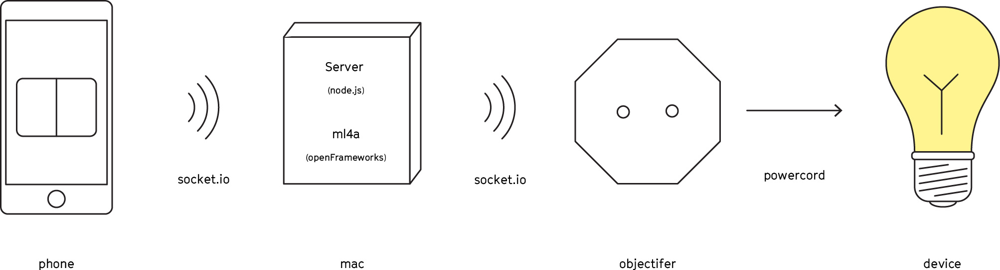

# OSP - Objectifier with Spacial Programming

This is a guide to install and run a screen-based demo of the [Objectifier](https://http://bjoernkarmann.dk/objectifier).


## Run

*Part 1 - Objectifer*

Open terminal on Mac

```
$ ssh pi@osp.local
```
Pasword: **koding6000**

Run this command:

```
$ mkdir /tmp/stream
$ raspistill --nopreview -w 320 -h 240 -q 10 -o /tmp/stream/pic.jpg -tl 100 -t 99999999 -th 0:0:0 &
LD_LIBRARY_PATH=/usr/local/lib mjpg_streamer -i "input_file.so -f /tmp/stream -n pic.jpg" -o "output_http.so -w /usr/local/www"
```
See result on ```osp.local:8080/?action=stream```

*Part 2 - ml4a*

Run the **ConvnetClassifierIp** app

*Part 3 - server*

Open the terminal and cd to the **osp** folder:

```
$ cd PATH-TO-FOLDER
```

Start the server:

```
$ npm start
```
*Part 4 - phone*

Open a browser on a phone and insert this url:

```
http://localhost:3000
```


## Setup
<br>


## Getting Started

This guide will explain how to setup the OSP both on the hardware and software side.


### Hardwhere:
- Phone (controller will run here)
- Mac computer (code will run here)
- The objectifier
- A device of choice (230V)
- 2x Powerplug

### Softwhere:

*Part 1 - ml4a*

- Install the latest version of [Xcode](https://itunes.apple.com/us/app/xcode/id497799835?ls=1&mt=12)
- Install the latest version of [openFrameworks](http://openframeworks.cc/download/)<br>*Uses this [guide](http://openframeworks.cc/setup/xcode/) to for installing openFrameworks in Xcode*
- Download the [ml4a-ofx](https://github.com/ml4a/ml4a-ofx/) application
- Drag the **ml4a-ofx** folder into the **apps** folder of openFrameworks
- Navigate to **ml4a-ofx/apps/**
- Download this repo and move the custom **ml4a/ConvnetClassifirIp** folder to the openFrameworks **ml4a-ofx/apps/** folder
- Open the **ConvnetClassifierIp.xcodeproj** file in Xcode
- Run the **ConvnetClassifierIp**
- Find and open the finished app under the folder **ConvnetClassifierIp/bin**

*Part 2 - server*

- Download this git-repostory and unzip.
- In terminal cd to the **osp** folder: ```cd PATH-TO-FOLDER``` 
- install the dependancies: ```npm install```
- test the installation by running the server: ```npm start```

### RaspberryPi:
This step is only required if a backup of the raspberry pi is needed

*Part 1 - Setup*

- Enable: camera, ssh, vnc, and remote gpio
- Create hostname: **osp**
- Change the password to: **koding6000**
- connect to raspberry **ssh pi@osp.local** (user is pi)

*Part 2 - Update*

The first command updates firmware and may require reboot.

```
$ sudo rpi-update
$ sudo apt-get update
$ sudo apt-get upgrade
```

*Part 3 - Install osc-rpio*

- Follow this [instructions](https://github.com/bjoernkarmann/osc-gpio)

## License

The MIT License (MIT)

Permission is hereby granted, free of charge, to any person obtaining a copy of this software and associated documentation files (the "Software"), to deal in the Software without restriction, including without limitation the rights to use, copy, modify, merge, publish, distribute, sublicense, and/or sell copies of the Software, and to permit persons to whom the Software is furnished to do so, subject to the following conditions:

The above copyright notice and this permission notice shall be included in all copies or substantial portions of the Software.
